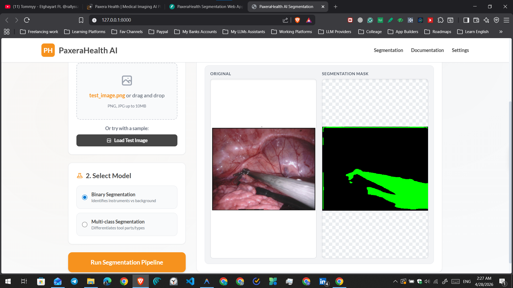

# PaxeraHealth AI Segmentation Web App



## Overview
This project is a production-ready Web Application designed for medical image segmentation on the EndoVis dataset. It provides an intuitive, clinical-grade user interface allowing clinicians or users to upload surgical images and immediately visualize AI predictions. 

The application is built on a robust architecture featuring a decoupled frontend and backend:
- **Frontend:** Vanilla HTML/CSS/JS styled with Tailwind CSS, strictly matching the PaxeraHealth brand aesthetics (clean, light mode, custom typography).
- **Backend:** High-performance RESTful API built with **FastAPI**, responsible for handling model inferences and serving static files.
- **AI Integration:** TensorFlow/Keras powered U-Net models for both Binary (instrument vs. background) and Multi-Class (tool differentiation) segmentation.

## Features
- **Binary Segmentation:** Rapidly identifies the boundaries of medical instruments from surgical scene backgrounds.
- **Multi-class Segmentation:** Differentiates between various parts or types of surgical tools, visualizing each class in a distinct color.
- **Dynamic Visualization:** Interactive split-view and overlay modes for detailed medical examination.
- **Clinical Aesthetics:** Themed identically to the PaxeraHealth official branding for a cohesive enterprise feel.
- **One-Click Startup:** A simple Windows Batch script (`run_app.bat`) that activates the environment, launches the backend, and opens the frontend automatically.

## Project Structure
```
.
├── .env                        # Environment variables (local)
├── .env.example                # Environment template
├── .gitignore                  # Git ignore rules
├── LICENSE                     # Project license
├── README.md                   # This file
├── INSTALLATION.md             # Detailed setup and troubleshooting guide
├── STRUCTURE.md                # Project architecture documentation
├── pyproject.toml              # Project metadata and dependencies
├── assets/                     # Sample inference outputs and test images
│   ├── prediction-from-test/
│   └── test_images/
├── data/                       # Raw and test data directories
│   ├── raw/                    # Original datasets
│   └── test/                   # Test datasets
├── models/                     # Saved U-Net model weights (.keras)
│   ├── best_unet_binary_scratch.keras       # Binary segmentation model
│   └── best_unet_multi_scratch.keras        # Multi-class segmentation model
├── notebooks/                  # Jupyter notebooks
│   ├── 01_Task_Description_AI_Candidate_Test.ipynb
│   └── 02_AI_Candidate_Test_Solution.ipynb
├── presentations/              # Professional presentations
├── scripts/                    # Utility scripts
│   ├── generate_presentation.py
│   └── get_notebook_results.py
└── web_app/                    # FastAPI backend and vanilla JS frontend
    ├── backend/
    │   ├── __init__.py
    │   ├── app.py              # FastAPI application with endpoints
    │   ├── model.py            # ML model inference logic
    │   ├── config.py           # Configuration management
    │   └── requirements.txt     # Python dependencies
    ├── frontend/
    │   ├── __init__.py
    │   ├── index.html          # Main HTML interface
    │   ├── script.js           # Frontend JavaScript logic
    │   ├── styles.css          # Custom CSS styling
    │   └── test_image.png      # Test image for UI verification
    └── run_app.bat             # Windows one-click startup script
```


## Prerequisites
- **Python 3.10+** ([Download](https://www.python.org/downloads/))
- **pip** (included with Python) or **uv** (optional, faster alternative)
- **Git** (for cloning the repository)

> **Note:** For detailed setup instructions with troubleshooting, see [INSTALLATION.md](INSTALLATION.md)

## Quick Start

### Windows (Easiest Method)
1. Double-click `web_app/run_app.bat`
2. The backend will start automatically and open the app in your browser

### Command Line (All Platforms)
```bash
# Navigate to backend directory
cd web_app/backend

# Install dependencies (choose one method below)

# Method 1: Using pip
pip install -r requirements.txt

# Method 2: Using uv (faster)
uv sync

# Start the application
python app.py
```

The application will be available at [http://127.0.0.1:8000/](http://127.0.0.1:8000/)

## Installation & Usage

### Detailed Setup
For comprehensive installation instructions, virtual environment setup, and troubleshooting:
- 📖 See [INSTALLATION.md](INSTALLATION.md)
- 🏗️ See [STRUCTURE.md](STRUCTURE.md) for architecture details

### Configuration
1. **Copy the environment template:**
   ```bash
   cp .env.example .env
   ```

2. **Optional: Customize settings in `.env`**
   ```
   BACKEND_HOST=127.0.0.1
   BACKEND_PORT=8000
   INFERENCE_CONFIDENCE_THRESHOLD=0.5
   ```

### Using the Application
1. **Upload an Image:** Drag and drop a surgical/endoscopic image or click to browse
2. **Select Model:** Choose **Binary** (instrument detection) or **Multi-class** (tool differentiation)
3. **Run Segmentation:** Click "Run Segmentation Pipeline"
4. **Visualize Results:** Toggle between split-view and overlay modes

### API Endpoints

| Endpoint | Method | Description |
|----------|--------|-------------|
| `/` | GET | Serve frontend HTML |
| `/predict` | POST | Run segmentation inference |
| `/health` | GET | Health check endpoint |
| `/docs` | GET | Interactive API documentation (Swagger UI) |

**Example prediction request:**
```bash
curl -X POST http://127.0.0.1:8000/predict \
  -F "file=@image.jpg" \
  -F "model_type=binary"
```

## Environment Configuration

Available configuration options in `.env`:

| Variable | Default | Description |
|----------|---------|-------------|
| `BACKEND_HOST` | 127.0.0.1 | Server address |
| `BACKEND_PORT` | 8000 | Server port |
| `BACKEND_RELOAD` | true | Auto-reload on code changes |
| `INFERENCE_TARGET_SIZE` | 256 | Model input resolution |
| `INFERENCE_CONFIDENCE_THRESHOLD` | 0.5 | Binary segmentation threshold |
| `LOG_LEVEL` | INFO | Logging verbosity (DEBUG, INFO, WARNING, ERROR) |

See [.env.example](.env.example) for all options.

## Features

### Segmentation Models
- **Binary Segmentation:** Detects surgical instruments (foreground) vs. background
- **Multi-class Segmentation:** Differentiates between specific tool types with color coding
- **Automatic Fallback:** Mock predictions enable UI testing without GPU/models

### User Interface
- **Modern Design:** Tailwind CSS with PaxeraHealth branding
- **Responsive Layout:** Works on desktop and mobile browsers
- **Dynamic Visualization:** 
  - Split-view mode for side-by-side comparison
  - Overlay mode for precise mask analysis
- **Test Image:** Quick demo without uploading your own image

### Technical Features
- **RESTful API:** Well-documented endpoints with OpenAPI/Swagger support
- **Centralized Configuration:** Environment-based settings management
- **Comprehensive Logging:** Detailed request/response tracking for debugging
- **Health Checks:** Endpoint for monitoring service availability
- **Error Handling:** Graceful degradation and informative error messages

## Architecture

```
User Browser (Frontend)
        ↓
    HTML/CSS/JS
    (Vanilla JS + Tailwind)
        ↓
    HTTP/REST
        ↓
FastAPI Backend (uvicorn)
    ├── Configuration Management (config.py)
    ├── Model Inference (model.py)
    ├── Request Handling (app.py)
    └── Static File Serving
        ↓
TensorFlow/Keras U-Net Models
    ├── Binary Model (256×256 input)
    └── Multi-class Model (256×256 input)
```

## Model Fallback Mode

If TensorFlow is not installed or model files are missing:
- ✅ The UI remains fully functional
- ✅ Mock predictions are served for testing
- ✅ Helpful warning messages are logged
- ✅ No crashes or errors

This allows you to test the frontend and API connections without GPU hardware or large model files.

## Built With

### Backend
- **FastAPI** - Modern Python web framework with async support
- **Uvicorn** - ASGI server for production-ready deployment
- **TensorFlow/Keras** - Deep learning framework for model inference
- **Pillow** - Image processing and format conversion
- **NumPy** - Numerical computations

### Frontend
- **Vanilla JavaScript** - No framework dependencies, pure JS
- **Tailwind CSS** - Utility-first CSS framework
- **HTML5** - Semantic markup and modern web standards

### Development & Packaging
- **Python 3.10+** - Language version
- **pip/uv** - Dependency management
- **pyproject.toml** - Modern Python project configuration

## Development

### Running in Development Mode
```bash
cd web_app/backend
python app.py
```
The server will auto-reload on code changes (BACKEND_RELOAD=true).

### Code Quality

```bash
# Format code
pip install black
black web_app/backend/

# Lint
pip install flake8
flake8 web_app/backend/

# Type checking (optional)
pip install mypy
mypy web_app/backend/

# Run tests (when available)
pip install pytest pytest-asyncio
pytest
```

### Debugging

Enable debug logging:
```bash
# In .env
LOG_LEVEL=DEBUG
```

Visit [http://127.0.0.1:8000/docs](http://127.0.0.1:8000/docs) for interactive API documentation.

## Troubleshooting

### Common Issues

**Port 8000 is already in use:**
```bash
# Option 1: Change port in .env
BACKEND_PORT=8001

# Option 2: Kill process using port 8000 (Windows)
netstat -ano | findstr :8000
taskkill /PID <PID> /F
```

**Models not loading:**
- Verify files exist: `models/best_unet_binary_scratch.keras`
- Check TensorFlow installation: `python -c "import tensorflow; print(tensorflow.__version__)"`
- Application will use mock fallback if models are missing

**TensorFlow import errors:**
```bash
# Reinstall TensorFlow
pip uninstall tensorflow -y
pip install tensorflow
```

For more troubleshooting, see [INSTALLATION.md](INSTALLATION.md).

## Project Documentation

- 📖 [INSTALLATION.md](INSTALLATION.md) - Setup guide with troubleshooting
- 🏗️ [STRUCTURE.md](STRUCTURE.md) - Project architecture and organization
- 📋 [.env.example](.env.example) - Configuration template
- 📦 [pyproject.toml](pyproject.toml) - Project metadata

## Dataset

This project uses the **EndoVis** dataset for surgical instrument segmentation. The dataset is configured in:
- `data/raw/` - Original dataset files
- `data/test/` - Test images for inference

Refer to the Jupyter notebooks for data processing details:
- `notebooks/01_Task_Description_AI_Candidate_Test.ipynb`
- `notebooks/02_AI_Candidate_Test_Solution.ipynb`

## Performance

### Model Information
- **Input Size:** 256×256 pixels (configurable)
- **Architecture:** U-Net
- **Binary Model:** Instrument vs. background
- **Multi-class Model:** 10 different tool classes

### Inference Speed
Typical inference time on modern hardware:
- **GPU (NVIDIA):** ~50-100ms per image
- **CPU:** ~500-1000ms per image
- **Mock Mode:** <10ms (for testing)

## License

This project is licensed under the MIT License - see the [LICENSE](LICENSE) file for details.

## Support & Contact

### Getting Help
1. **Check documentation first:**
   - [INSTALLATION.md](INSTALLATION.md) - Setup issues
   - [STRUCTURE.md](STRUCTURE.md) - Architecture questions
   - [.env.example](.env.example) - Configuration help

2. **Troubleshooting guide above** - Common issues and solutions

3. **API Documentation:**
   - Run the app and visit [http://127.0.0.1:8000/docs](http://127.0.0.1:8000/docs)
   - Interactive Swagger UI for endpoint testing

### Repository
- **Repository:** [github.com/MohammedHamza0/PaxeraHealth-AI](https://github.com/MohammedHamza0/PaxeraHealth-AI)
- **Issues:** Open an issue on GitHub for bugs or feature requests
- **Discussions:** Use GitHub Discussions for general questions

### Authors
- Mohammed Hamza - Initial development

## Quick Links

| Link | Purpose |
|------|---------|
| [INSTALLATION.md](INSTALLATION.md) | Step-by-step setup guide |
| [STRUCTURE.md](STRUCTURE.md) | Project architecture |
| [.env.example](.env.example) | Configuration options |
| [pyproject.toml](pyproject.toml) | Dependencies |
| [http://127.0.0.1:8000/docs](http://127.0.0.1:8000/docs) | API documentation (when running) |
| [http://127.0.0.1:8000/health](http://127.0.0.1:8000/health) | Health check (when running) |

---

**Ready to get started?** See [Quick Start](#quick-start) above or follow [INSTALLATION.md](INSTALLATION.md) for detailed instructions.
